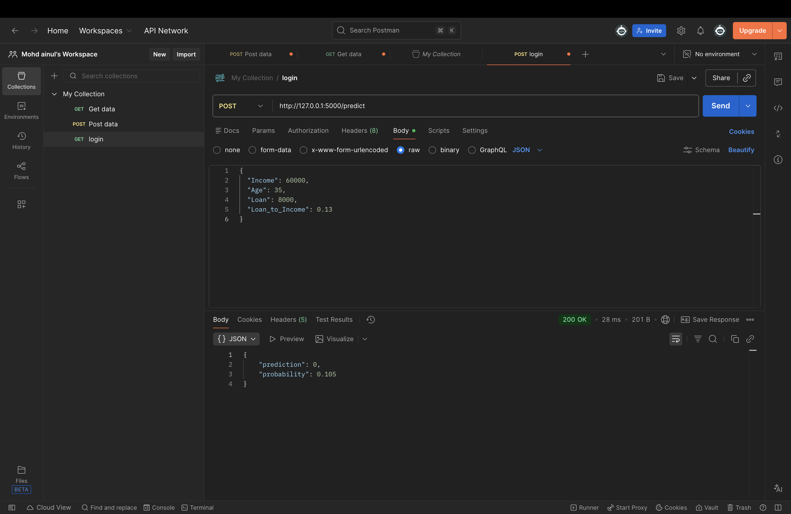

# 💳 Credit Card Default Prediction

A simple machine learning project that predicts whether a customer is likely to default on a loan based on financial details.

---

## 📸 Project Preview



## 🚀 Overview

This project uses a Logistic Regression model to classify whether a person will default (1) or not (0).

The idea is to understand how basic financial features like income, age, and loan amount influence credit risk.

---

## 📊 Features Used

- Income
- Age
- Loan
- Loan to Income Ratio

---

## 🧠 Model Used

**Logistic Regression (scikit-learn)**

Why this model?

- Works well for binary classification
- Simple and efficient
- Good starting point for ML projects

---

## ⚙️ Tech Stack

- Python
- Pandas
- NumPy
- Scikit-learn
- Flask

---

## 📁 Project Structure

credit-default/
│
├── app.py # main file (model + API)
└── README.md

---

## ▶️ How to Run

### 1. Clone the repository

```bash
git clone https://github.com/your-username/credit-default.git
cd credit-default
```

2. Install dependencies
   python3 -m pip install pandas scikit-learn flask numpy

3. Run the project
   python3 app.py

You should see:
model accuracy: ~0.95
Running on http://127.0.0.1:5000

⸻

🌐 API Endpoints

🏠 Home Route
GET /
Response:
API is running 🚀

Prediction Route
Example Request

{
"Income": 60000,
"Age": 35,
"Loan": 8000,
"Loan_to_Income": 0.13
}

REsponse
{
"prediction": 0,
"probability": 0.12
}

⸻

🧪 How to Test

You can test the API using:
• Postman
• Thunder Client (VS Code extension)
• cURL

⸻

⚠️ Notes
• /predict endpoint only accepts POST requests
• Opening it directly in browser will not work
• Tested on Safari and Postman

⸻

💡 What I Learned
• How to build a machine learning model
• Difference between features (X) and target (y)
• Importance of data scaling
• How to convert a model into an API using Flask

⸻

🚀 Future Improvements
• Add frontend (React)
• Deploy API (Render / Railway)
• Try advanced models (Random Forest, XGBoost)
• Improve validation and logging

⸻

⭐ Final Thoughts

This project covers the complete pipeline:

data → model → API

If you found this useful, consider giving it a ⭐
